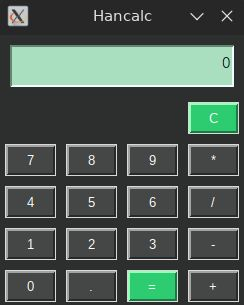

# 👩‍💻 Calculadora en Tkinter

## 🏠 Bienvenido a Hancalc

### 🚀 Características

### 💪 Interfaz gráfica simple y elegante

### 📈 Operaciones básicas: suma, resta, multiplicación, división y resto (%)

### 🔄 Soporte para paréntesis en las operaciones

### 📝 Prevención de errores como división por cero y síntaxis inválida

### 🛠️ Instalación

**Clona el repositorio:**

      git clone https://github.com/hanco89/hancalc-basic.git

**Accede al directorio:**

      cd hancalc-basic

***Asegúrate de tener Python instalado 🐍***

**Ejecuta la calculadora:**

      python3 main.py

### 🏢 Estructura del Código

**Calculator 🏰**: Clase principal que maneja la interfaz y las operaciones.

**ShowResult 🛠**: Etiqueta donde se muestran los números y resultados.

**buttons 🔢**: Diccionario de botones con sus respectivas funciones.

**Calculation() 🧙**: Función encargada de realizar los cálculos.

**HandleInput() 🛡**: Filtra los datos ingresados y llama a la función adecuada.

### 📸 Capturas de Pantalla

### 🤝 Contribuciones

🎉 Toda contribución es bienvenida. Si tienes ideas o mejoras, abre un issue o un pull request.

## 📌 Autor: Hanco89 💻